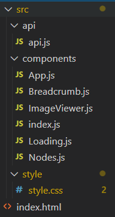

## 프로그래머스 과제관 - 고양이 사진첩

### 파일 구조

- index.html
- index.js > app 생성
- Breadcrumb.js > 이동 경로
- Nodes.js > 현재 경로의 데이터 모음
- ImageViewer.js > 사진일 경우 보여주는 뷰어
- Loading.js > fetch 로딩 처리
- api.js > fetching
- App.js > Breadcrumb, Nodes, ImageViewer, Loading을 다루며 동작 제어
 

### 풀이 참고